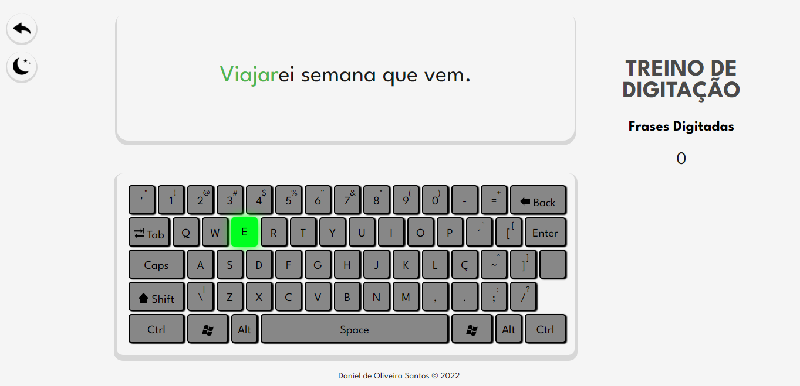
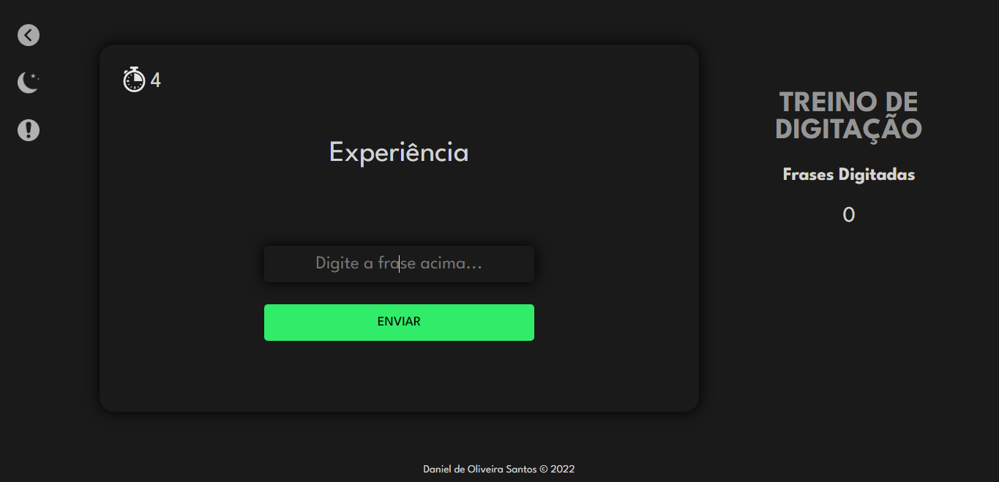

# ⌨️ Treino de Digitação

Projeto com intuito principal de ajudar aqueles que não possuem familiaridade com o teclado do computador. O desenvolvimento foi uma ótima oportunidade para colocar em prática os estudos de NodeJS, criando rotas específicas com express, além da engine EJS para visualização das páginas.

## ⚙️Tecnologias
- HTML
- CSS
- Javascript
- Sass
- NodeJS
- Express

## 📸 Screenshots

### 💻 Desktop
 
 

## 🔗Deploy
#### https://treino-de-digitacao.vercel.app/
